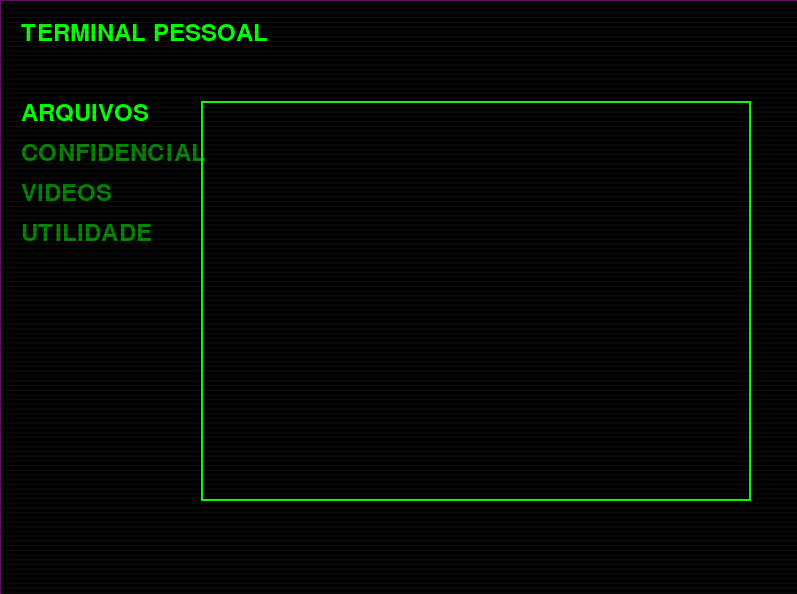

## COMANDO NECESSARIOS
```
pip install pygame
pip install pygame PyOpenGL
```
## EXECUÇÃO
```
python ./screen.py
```
ou
```
python3 ./screen.py
```
## Problema
Caso ocorre algum problema com o PyOpenGL, execute o programa sem o shader presente no arquivo "screen_no_shader.py" 

## Telas 
### COM SHADER


## FFmpeg
Necessario para executar o video

### Windows
1. Baixe o FFmpeg no site oficial:
🔗 https://ffmpeg.org/download.html
2. Extraia os arquivos em uma pasta, por exemplo: C:\ffmpeg
3. Adicione ao PATH:
* Vá em Painel de Controle → Sistema → Configurações Avançadas do Sistema
* Clique em Variáveis de Ambiente
* Em Variáveis do Sistema, encontre Path e edite
* Adicione o caminho C:\ffmpeg\bin
4. Teste rodando ffmpeg -version no terminal.